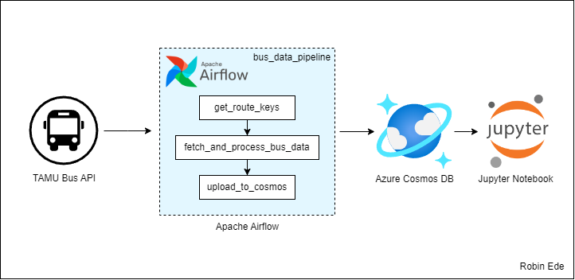
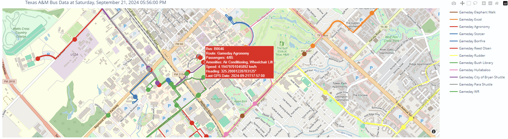

# Bus Data Engineering Project

## Overview

This project is a data engineering pipeline designed to collect, process, and visualize real-time bus transit data for your university's bus system. Utilizing Apache Airflow orchestrated via Docker and Docker Compose, the pipeline performs the following tasks:

1. **Retrieve Route Data**: Fetches active route keys, named and unnamed stops.
2. **Fetch and Process Bus Data**: Gathers bus position data, including velocity, bearing, capacity, amenities, and associated route information.
3. **Upload to Cosmos DB**: Stores the processed data in Azure Cosmos DB for scalable access and querying.

An MVP (Minimum Viable Product) is included as a Jupyter Notebook that allows users to visualize bus routes and positions on an interactive map at a given timestamp using Plotly and the Azure Cosmos SDK.

## Architecture


*Alt text: Diagram illustrating the data pipeline from data ingestion to visualization.*

The project leverages Apache Airflow orchestrated through Docker and Docker Compose to manage data retrieval and processing tasks. The high-level workflow is as follows:

1. **Task: Get Route Keys**
   - Retrieves active route information.
   - Stores route data temporarily for downstream tasks.

2. **Task: Fetch and Process Bus Data**
   - Uses route data to fetch real-time bus information.
   - Processes data to extract relevant attributes.
   - Appends the scheduled task time to each vehicle's data for timestamping.
   - Stores processed data temporarily for uploading.

3. **Task: Upload to Cosmos DB**
   - Uploads the processed stop and vehicle data to Azure Cosmos DB using an Airflow connection named `cosmos-db`.
   - Cleans up temporary files to maintain optimal storage usage.

## Features

- **Dockerized Airflow Setup**: Simplifies deployment and scaling using Docker and Docker Compose.
- **Automated Data Pipeline**: Fully automated data ingestion and processing using Apache Airflow.
- **Real-Time Data Processing**: Fetches live bus data for up-to-date information on the university's bus system.
- **Scalable Data Storage**: Utilizes Azure Cosmos DB for efficient and scalable data storage.
- **Interactive Visualization**: Provides a Jupyter Notebook for mapping buses and routes using Plotly.
- **Modular Design**: Clean separation of tasks for easy maintenance and scalability.

## Getting Started

### Prerequisites

- **Docker**
- **Docker Compose**
- **Azure Account**: For Cosmos DB.
- **Jupyter Notebook**
- **Azure Cosmos SDK for Python**
- **Plotly**

### Installation

1. **Clone the Repository**

   ```bash
   git clone https://github.com/yourusername/bus-data-engineering.git
   cd bus-data-engineering
   ```

2. **Configure Environment Variables**

   - Create a `.env` file in the project root directory to store environment variables required for Airflow and Azure Cosmos DB connections.

     ```env
     AIRFLOW__CORE__LOAD_EXAMPLES=False
     AIRFLOW_UID=50000

     # Azure Cosmos DB Configuration
     AZURE_COSMOS_ACCOUNT_URI=your_cosmos_db_uri
     AZURE_COSMOS_ACCOUNT_KEY=your_cosmos_db_key
     ```

3. **Set Up Airflow Connections**

   - In Airflow, set up a connection named `cosmos-db` to store the Cosmos DB variables.
   - Since the built-in Azure Cosmos DB connection type may not work, set the connection type to **HTTP** and store the necessary credentials in the **Extra** field in JSON format.

     ```json
     {
       "account_uri": "your_cosmos_db_uri",
       "account_key": "your_cosmos_db_key",
       "database_name": "your_database_name",
       "container_name": "your_container_name"
     }
     ```

4. **Build and Start the Docker Containers**

   - Build the Docker images and start the services using Docker Compose.

     ```bash
     docker-compose up -d --build
     ```

   - This will start the following services:
     - **Airflow Scheduler**
     - **Airflow Webserver**
     - **Airflow Worker**
     - **Airflow Triggerer**
     - **Airflow Postgres Database**
     - **Airflow Redis**

5. **Verify Airflow is Running**

   - Access the Airflow web interface at `http://localhost:8080`.
   - The default credentials are:
     - **Username**: `airflow`
     - **Password**: `airflow`

## Usage

### Airflow DAG

1. **Deploy the DAG**

   - Place your DAG files in the `dags/` directory. Since the `dags/` folder is mounted as a volume in the Docker Compose file, Airflow will automatically detect and load the DAG.

     ```bash
     cp dags/*.py ./dags/
     ```

2. **Trigger the DAG**

   - Access the Airflow web interface at `http://localhost:8080`.
   - Locate the `bus_data_pipeline` DAG.
   - Trigger it manually or set it to run on a schedule.

### Data Visualization

1. **Install Python Dependencies**

   - Activate your Python environment and install necessary packages for data visualization.

     ```bash
     pip install -r requirements.txt
     ```

2. **Launch Jupyter Notebook**

   ```bash
   jupyter notebook
   ```

3. **Open the Visualization Notebook**

   - Open `plotting.ipynb`.
   - Update the notebook with your Cosmos DB connection details.
   - Run the notebook to generate interactive maps of bus routes and positions.

     
     *Alt text: Screenshot of an interactive map displaying bus routes and positions using Plotly.*


## Configuration

### Airflow Connection for Azure Cosmos DB

- **Connection ID**: `cosmos-db`
- **Connection Type**: `HTTP`
- **Host**: Leave blank
- **Extra**:

  ```json
  {
    "account_uri": "your_cosmos_db_uri",
    "account_key": "your_cosmos_db_key",
    "database_name": "your_database_name",
    "container_name": "your_container_name"
  }
  ```

In your Airflow tasks, you can retrieve the connection and use the stored credentials to interact with Azure Cosmos DB.

### Environment Variables

- **AIRFLOW__CORE__LOAD_EXAMPLES**: Set to `False` to prevent loading example DAGs.
- **AIRFLOW_UID**: Set to your user ID (e.g., `50000`).

Store these in your `.env` file.

## Dependencies

- **Docker**
- **Docker Compose**
- **Apache Airflow**
- **Azure Cosmos SDK**
- **Plotly**
- **Requests**
- **Python Packages**:

  Install all Python dependencies using:

  ```bash
  pip install -r requirements.txt
  ```
